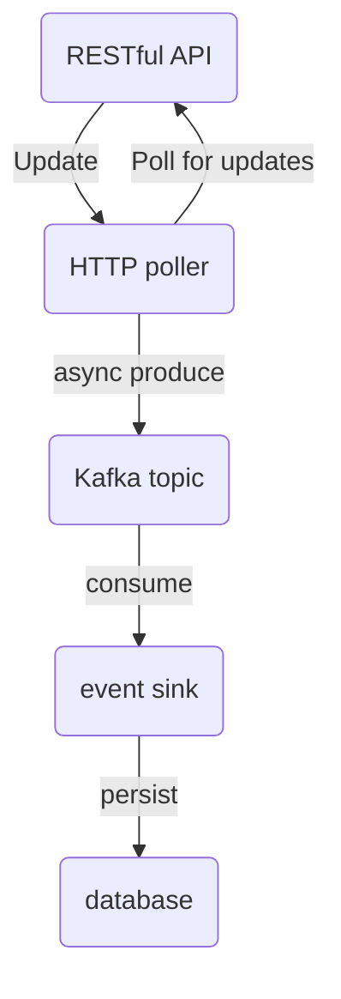

# kafka-java-poc
A Kafka Proof-Of-Concept written in Java

## Basic architecture

```mermaid 
flowchart TB
    A(RESTful API) -->|Update| B(HTTP poller);
    B -->|Poll for updates|A;
    B --> |async produce|C(Kafka topic);
    C -->|consume| D(event sink);
    D -->|persist| E(database);
```